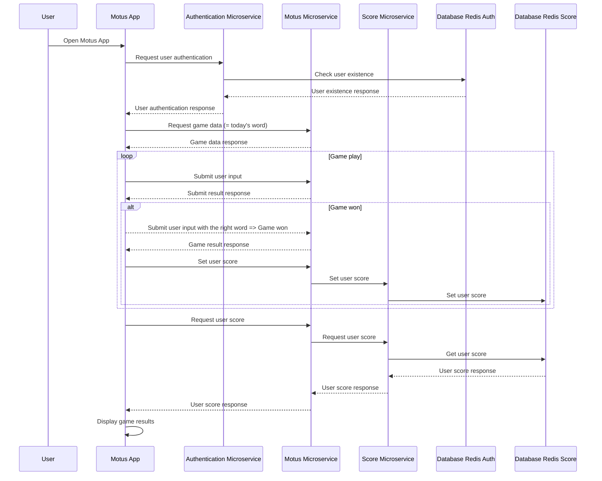

# Motus Project :computer:
Repository for the MicroServices course : MOTUS project


Authors : Benoit BOUAPHAKEO, Benjamin BEWEKEDI, Sarah MESROUA (ING3 IA 1, CY TECH)


# Architecture

## Diagramme de workflow


## Diagramme de Séquence


## 1.Informations Générales
Utilisation de Express pour créer un serveur pour chaque microservice :
```
const express = require('express');
const app = express();
```


Utilisation de Redis pour la base de données de score et d'utilisateur : 
```
// Créer un client Redis
const client = redis.createClient({
url: REDIS_URL
});
const connectToRedis = async () => {
try {
await client.connect();
console.log('Connected to Redis');
} catch (error) {
console.error('Failed to connect to Redis:', error.message);
}
};
connectToRedis();
```


## 2. Motus Microservice (`motus.js`)
Ce service est responsable de la gestion du système de score de l'application Motus.

- Création du server Node.js ‘motus.js’.
- Port spécifié : port 3000 (par défaut)
- Définitions des APIs :
  - Middleware  `isLoggedIn` :  vérifie si l'utilisateur est authentifié afin de permettre l'accès au routes de l'application. Si l'utilisateur n'est pas authentifié et que la route demandée n'est pas "/callback", l'utilisateur est redirigé vers un serveur d'authentification pour effectuer la connexion.
  - Route `/callback` : gère la réponse après une authentification réussie. Lorsqu'un utilisateur est redirigé vers cette route après s'être authentifié, elle récupère le code d'autorisation, effectue une requête vers un serveur d'authentification pour échanger le code contre un ticket d'accès. Le ticket d'accès est ensuite vérifié et le nom d'utilisateur est extrait à partir de celui-ci. Enfin, le nom d'utilisateur est stocké dans la session de l'utilisateur et l'utilisateur est redirigé vers la page d'accueil.
  -  Route `/logout` : gère la déconnexion de l'utilisateur. Supprime le ticket et la session et redirige l'utilisateur vers la page d'accueil.
  - Route racine `'/'` : renvoie le fichier "motus.html" situé dans le dossier "www".
  - Route `/wordOfTheDay` : permet de génerer le mot du jour à partir de la liste des mots (fichier `liste_francais_utf8.txt`) et de la fonction `generateDailyRandomNumber` qui génère un nombre aléatoire quotidien basé sur la date actuelle.
  - Routes  `/getScore` et  `/setScore/:value` : récupère et définit (respectivement) le score de l'utilisateur en effectuant une requête vers un serveur de score.
  - Route `/port` : renvoie un message indiquant l'hôte et le port sur lesquels l'application "Motus" est en cours d'exécution.


## 3. Score Microservice (`score.js`)
Ce service est responsable de la gestion du système de score de l'application Motus.
- Création du server Node.js ‘score.js’ qui interagit avec une base de données Redis. 
- Port spécifié : port 3500
- Définitions des APIs :
  - Route ‘/set/:key/:value’ : prend une clé et une valeur en tant que paramètres. Il récupère la valeur actuelle associée à la clé fournie depuis la base de données Redis en utilisant `client.get(key)`. Si la clé existe, il calcule un nouveau score en ajoutant la valeur fournie au score actuel, puis définit le nouveau score dans la base de données Redis en utilisant `client.set(key, newScore)`. Si la clé n'existe pas, réponse 404. Les opérations réussies renvoient  réponse 200, tandis que les erreurs renvoient réponse 500.
  - Route ‘/setUser/:key/:value’ : définit la paire clé-valeur fournie directement dans la base de données Redis sans aucun calcul. Il répond avec un statut 200 si la clé est définit clé et un statut 500 en cas d'erreur.
  - Route ‘/get/:key’ : récupère la valeur associée à la clé fournie depuis la base de données Redis en utilisant `client.get(key)`. Si la clé existe, il renvoie la valeur avec un message personnalisé. Sinon, il renvoie une réponse indiquant que la clé n'existe pas.


## 4. Authentification Motus Microservice (`auth.js`)
Ce service gère l'authentification des utilisateurs de l'application Motus.

- Création du server Node.js ‘auth.js’.
- Port spécifié : port 4000 (par défaut)
- Définitions des APIs :
   - Route `/` : renvoie une réponse "Hello World!" pour tester le serveur.
   - Route `/authorize` : gère la demande d'autorisation. Vérifie les paramètres de la requête (clientid, scope, redirect_uri) et renvoie un formulaire de connexion HTML si les paramètres sont valides.
   - Route `/login` : gère la soumission du formulaire de connexion. Vérifie le nom d'utilisateur et le mot de passe dans la base de données Redis. Si les informations sont valides, génère un code aléatoire, stocke le code dans Redis et redirige l'utilisateur vers l'URL de redirection avec le code.
   - Route `/token` : gère la demande de jeton d'authentification. Vérifie le code dans Redis, génère un jeton d'identité JWT avec les informations nécessaires, et renvoie le jeton dans la réponse.
   - `/signUpPage` : renvoie une page HTML pour l'inscription d'un nouvel utilisateur.
   - `/signup` : gère la soumission du formulaire d'inscription. Vérifie les informations d'inscription, enregistre l'utilisateur dans le service d'authentification et le service de score, puis redirige l'utilisateur vers la page d'accueil.
   - Route `/session` : renvoie les informations de session actuelles.
   - Route `/set/:key/:value` : définit une clé et sa valeur correspondante dans Redis.
   - Route `/get/:key` : récupère la valeur d'une clé spécifique dans Redis.
   - Route `/delete/:username` : supprime toutes les clés correspondant à la valeur de l'utilisateur spécifié dans Redis.

## 5. Gestion du jeu (`script_index.js`)
Le fichier `script_index.js` permet de jouer à une partie de MOTUS. Il gère l'affichage de la grille, la saisie des lettres par l'utilisateur, la vérification des correspondances et le calcul du score.

- Mise en page et affichage de la grille, des lettres, etc :
    - Initialisation de la grille du jeu : Des cellules vides sont ajoutées à chaque ligne de la grille en fonction de la taille du mot du jour.
    - Pré-remplissage de la grille : Les cellules de la grille sont pré-remplies avec des points (`.`) en utilisant la fonction `point()` et première cellule de chaque ligne est remplie avec la première lettre du mot du jour en utilisant la fonction `lettre()`.
    - Traitement des lettres : Lorsque l'utilisateur appuie sur  "Entrée", le mot proposées par l'utilisateur est récupéré et comparé avec le mot du jour.
    - Gestion du délai : fonction `traitementAvecDelai(i, callback)` définie pour traiter chaque lettre avec un délai de 0,3 seconde entre chaque lettre lors de la vérification. cela permet d'ajouter une animation
    - Passage à la ligne suivante : fonction `passerALaLigneSuivante()` définie pour passer à la ligne suivante une fois que le traitement des lettres est terminé. Si toutes les lettres sont correctement placées, le score est mis à jour et un message de félicitations est affiché. Sinon, la grille passe à la ligne suivante.
    - Suppression d'une lettre : Lorsque l'utilisateur appuie sur la touche "Effacer", la dernière lettre saisie est supprimée de la grille.

- Fonction de jeu, de comparaison et de score :
    - Fonction `strNoAccent(a)` : Supprime les accents d'une chaîne de caractères en utilisant la méthode `normalize`.
    - Requête AJAX (`$.get("/wordOfTheDay", (data) => { ... });`) : Récupère le mot du jour depuis l'URL "/wordOfTheDay". Le mot du jour est stocké dans la variable `motDuJour` après avoir été converti en majuscules et sans accents à l'aide de la fonction `strNoAccent(a)`.
    - Fonction `sontIdentiques(liste1, liste2)` : Vérifie si deux listes sont identiques en comparant leur longueur et en utilisant la méthode `every` pour vérifier si chaque élément est égal dans les deux listes.
    - Requête AJAX (`$.get("/getScore", (data) => { ... });`) : Récupère le score depuis l'URL "/getScore" et l'affiche dans un élément HTML avec l'ID "score".

## 6. Pages HTML
Les pages HTML ```login.html```, ```motus.html``` et ```signup.html``` définisse les pages qui contiennent le jeux de MOTUS, la page de connexion si l'utilisateur à un compte et la page d'inscription si l'utilisateur n'a pas de compte. 

## 7. `Dockerfile` et Docker Compose (`docker-compose.yml`)
Les fichiers Dockerfile permettent de créer les images des serveurs auth, motus et score.


Le fichier docker-compose permet la création simultanée de conteneurs des images aut, motus et score.

Dans le docker-compose, on definit :
- services ou conteneurs qui composent l'application :
    - `redis1` : utilise l'image redis:latest, expose le port 6379 et se connecte au réseau `ms-motus_redis_net`. Il monte un répertoire local `./data/redis/redis1` en tant que volume pour la persistance des données.
    - `redis2` : similaire à redis1, utilise l'image redis:latest, expose le port 6380 et se connecte au réseau `ms-motus_redis_net`. Il monte `./data/redis/redis2` en tant que volume.
    - `redisinsight` : utilise l'image redislabs/redisinsight:latest, expose le port 8001 et se connecte au réseau `ms-motus_redis_net`. Il monte `./data/redisinsight` en tant que volume. Il dépend des services redis1 et redis2, ce qui signifie qu'il démarrera après eux.
    - `auth` : construit en utilisant le répertoire ./auth comme contexte de construction. Il expose le port 4000 et définit la variable d'environnement `REDIS_URL` sur `redis://redis2:6379`. Il se connecte au réseau `ms-motus_redis_net` et dépend du service `redis2.`
    - `motus` : Ce service est construit en utilisant le répertoire `./motus` comme contexte de construction. Il expose le port 3000 et se connecte au réseau `ms-motus_redis_net.`
    - `score` : Ce service est construit en utilisant le répertoire `./score` comme contexte de construction. Il expose le port 3500 et définit la variable d'environnement `REDIS_URL` sur `redis://redis1:6379`. Il se connecte au réseau `ms-motus_redis_net`.

- networks utilisés par les services :
    - `ms-motus_redis_net` : Ce réseau est créé avec le pilote IPAM (IP Address Management) default. Il est configuré avec le sous-réseau `172.28.0.0/16`, ce qui spécifie la plage d'adresses IP pouvant être utilisée par les conteneurs connectés à ce réseau.

# Configuration et Utilisation :wrench:
    
1. Clonez ce répertoire sur votre machine locale :  ```git clone https://github.com/SarahMesroua/ms-motus.git```. Si vous avez un message d'erreur ```acces denied``` faire la commande `git config --get user.email`
2. Se placer dans le répertoire ms-motus et ouvrir un terminal.
3. Modifier les autorisations du fichier avec la commande ```chmod -R 777 ./data/redisinsight```

4. Vous pouvez maintenant accéder à l'application Motus en lancant la commande ```docker-compose up ``` et en ouvrant le navigateur sur l'URL appropriée.

# Infos pratiques
- Le mot du jour est dans la console du navigateur (inspecteur d'élément de la page motus.html).
- Le port 8001 permet de visualiser les bases de données Redis.
- Les codes générés et stockés dans la bdd redis "auth" lors d'une connexion sont supprimés lors d'une déconnexion. Si on arrête un serveur alors que l'utilisateur ne s'est pas déconnecté, alors  le code ne sera pas supprimé de la bdd.
- Un joueur peut gonfler son score en entrant le même mot plusieurs fois dans une même journée.
  

# Travail Bonus : Flask sur le répo https://github.com/Benji2709/ms-motus
- Installer les dépendances flask
- Dans le terminal:
    - ``ip install flask flask_sqlalchemy flask_login flask_bcrypt flask_wtf wtforms email_validator`
    - avec flask : le localhost a le port 5000 par défaut (python3 app.py)
    - donc le lien est : https://localhost:5000

Installer sqlite3 : ```sudo apt install sqlite3```

```database.db``` dans ```le folder flask-auth/instance/``` contient les données utilisateurs


Pour y accéder dans le terminal : 
- Se placer dans le folder instance:
    - sqlite3 database.db
    - sqlite> .schema user; ⇒ affiche la table user et ses caractéristiques: id, username,password,ticket
    - sqlite> requête SQL select * from  user; (on sélection tout de la table user)


